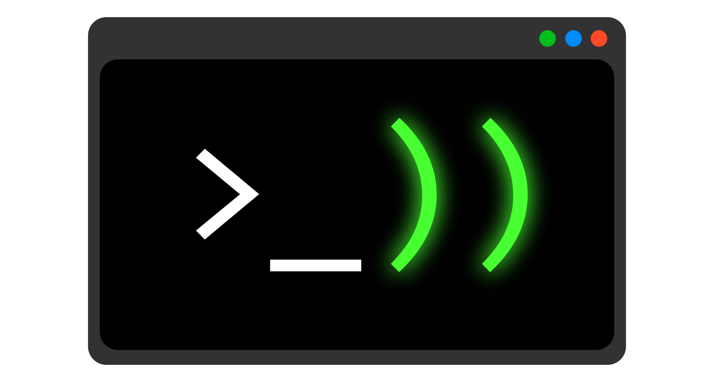
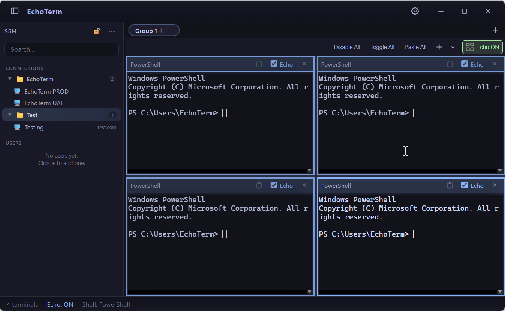
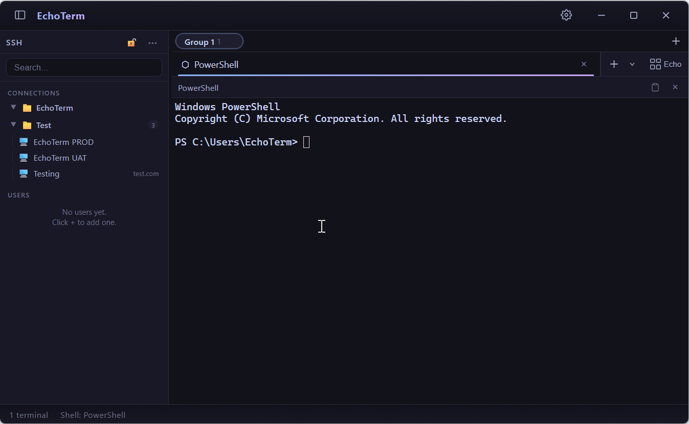
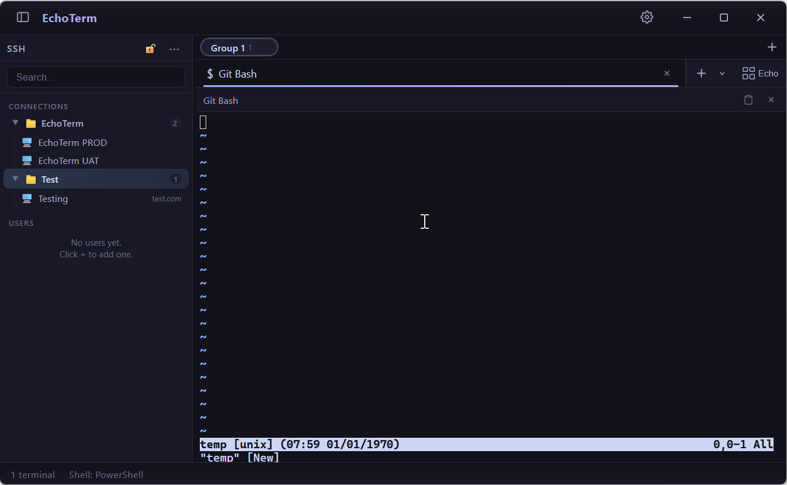
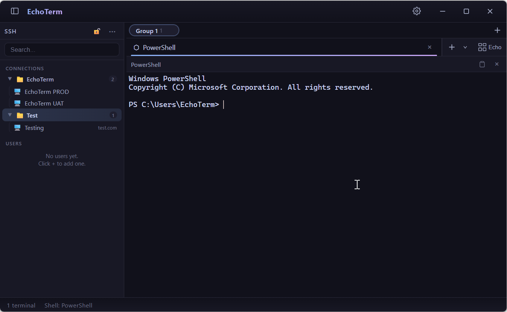
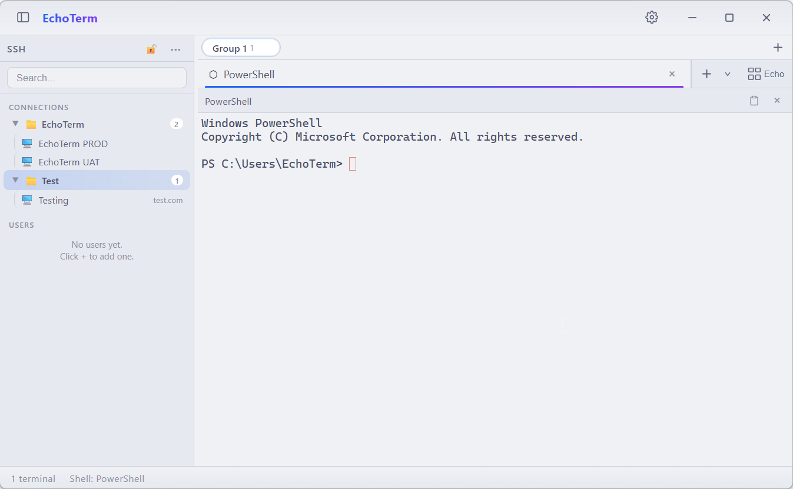

# EchoTerm

  

**English** | [繁體中文](README.zh-Hant.md)

A split-view terminal app with **echo input** — type once, and your commands go to multiple terminals at the same time. Yeah, it's really that simple.

## Why EchoTerm?

I kept looking for a good terminal that lets you type into several terminals at once, and… well, I couldn't find one. So I just made it myself. EchoTerm started from that exact itch, and everything else grew around it.

> **A quick note:** Right now EchoTerm runs on **Windows** only. **macOS** support is on my radar and will show up eventually — no promises on when, but it's coming.

---

## Features

### Echo Mode
Type in one terminal and watch your input show up in all the selected terminals of the group — perfect for firing the same command at several machines without breaking a sweat.

- Toggle echo per terminal, or just flip them all at once
- "Paste All" shoots your clipboard to every echo-enabled terminal

  

### Tabs & Groups
- Tuck your terminals into **tabs**, and tabs into **groups** (workspaces)
- Right-click to rename, move between groups, or close selected/other tabs

  

### SSH Connection Manager
- Save and organize SSH connections, users, and folders in a searchable sidebar
- Connect with a single click; connections open right up as terminal tabs
- Import from and export to `~/.ssh/config`
- Keep your connections safe with a **master password** or OS-level encryption

  

### Personalization
- Dark and light themes — take your pick
- Adjustable UI and terminal font sizes
- Pick your default shell: **PowerShell**, **CMD**, or **Git Bash**
- 13 interface languages: English, German, Spanish, French, Japanese, Korean, Polish, Portuguese (Brazil), Russian, Turkish, Vietnamese, Chinese Simplified, Chinese (HK)

### Quality-of-Life Details
- Right-click to copy/paste (configurable, of course)
- Paste preview for multi-line content
- Close confirmations for tabs, groups, and the window (each can be turned off)

  

### And More
There are more features waiting for your exploration — poke around and see what else EchoTerm can do.

---

## Screenshots

  

  

---

## Requirements

- **Windows 10 / 11** (64-bit)
- **Git Bash** support needs [Git for Windows](https://git-scm.com/download/win) (PowerShell and CMD are already built into Windows)
- SSH connections use the `ssh` client that ships with Windows

## Installation

Grab the latest release:

- **Installer** (`EchoTerm-Setup-x.x.x.exe`) — the standard Windows installer
- **Portable ZIP** (`EchoTerm-x.x.x-win.zip`) — unzip it once, then just run `EchoTerm.exe`

---

## Keyboard Shortcuts

| Shortcut | Action |
|---|---|
| `Ctrl+Shift+N` | New terminal |
| `Ctrl+Shift+T` | Toggle echo mode |
| `Ctrl+W` | Close active terminal |
| `Ctrl+Tab` / `Ctrl+Shift+Tab` | Switch terminal |
| `Ctrl+Shift+S` | Show/hide SSH sidebar |

---

## Feedback & Issues

EchoTerm is still in its early days. I'm not taking code contributions just yet, but **issue reports are super welcome** — your feedback genuinely shapes where this thing goes.

There's still a bunch of stuff on my roadmap waiting to be built, and your input helps me figure out what to work on next.

Feel free to open an issue if you:

- Hit a bug — throw in steps to reproduce, what you expected vs. what actually happened, and your Windows version
- Have a feature request or idea — tell me the use case and what problem it solves
- Spot a translation issue in any of the supported languages

Before opening a new issue, give the existing ones a quick search to avoid duplicates.

You can also ping me directly at [echoterm2125@gmail.com](mailto:echoterm2125@gmail.com).

---

## License

EchoTerm is licensed under the **PolyForm Shield License 1.0.0** — you're free to use, copy, modify, and share it, **but you can't sell it or offer it as a competing service**. Check out [LICENSE](LICENSE) for the full text.
